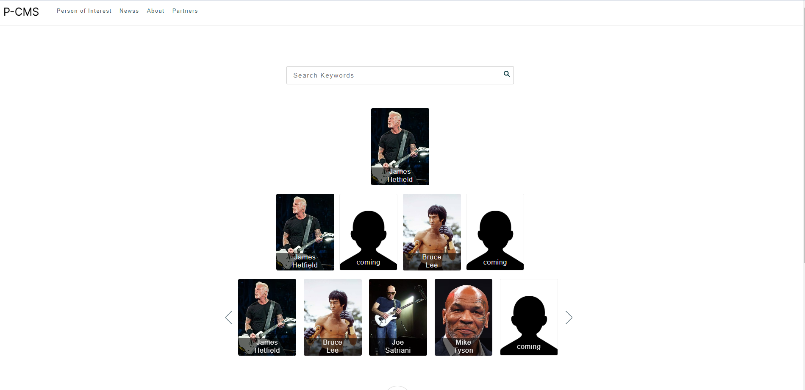
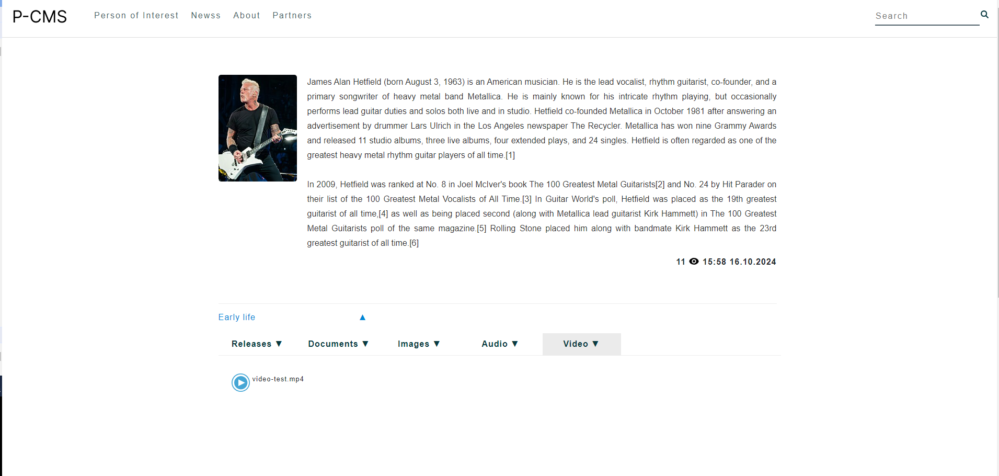
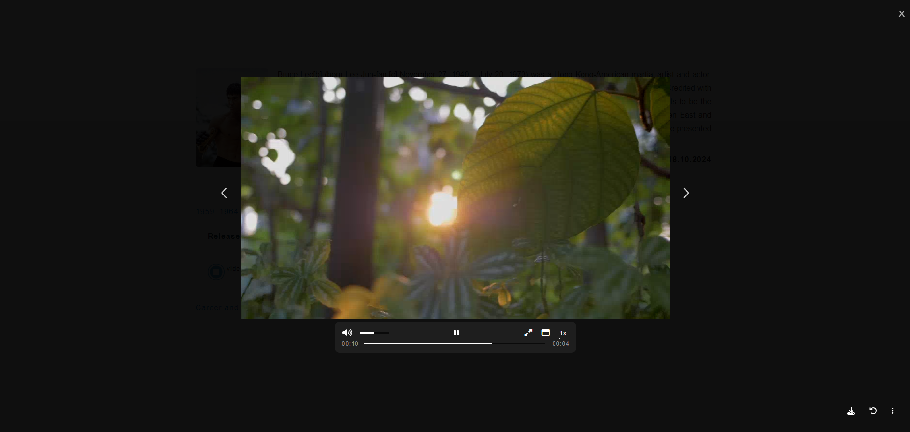

# Persons CMS Website

This is a custom CMS (Content Management System) built using React for the frontend, Node.js with Express for the backend, and MariaDB as the database. The CMS allows users to dynamically manage content, specifically focused on handling "Persons" in the system. It provides an admin dashboard for performing tasks like adding users, managing posts, sorting persons, tracking system information, and creating database backups.

## Front Page

- **Homepage**:

    
  The main landing page showcases various features and content of the CMS.

- **Person Details Page**:

    
  This page displays detailed information about a selected person, along with any media files uploaded through the "Persons of Interest" posts in the dashboard.

- **Video Player Component**:

    
  A dedicated video player component is integrated to enhance the viewing experience.

## Features

- **Admin Login**: Admins can log in through the `/admin` route using the default credentials:
  - **Username**: `admin`
  - **Password**: `admin1234`
  - **Note**: Same password and username is for the live demo https://persons-cms.keni.ba/admin

### Admin Dashboard

Once logged in, the admin can access the dashboard at `/admin/dashboard`. From here, they can:

- Add new users
- Create and manage posts
- Update header navigation and logo
- Modify footer items
- Sort persons on the homepage
- Track visitor IPs
- View system information
- Create backups for the database and backend


### Add Users

Easily manage users, including adding, editing, and deleting them.


### Create and Manage Posts

Admins can add, edit, and delete posts directly from the dashboard.


#### Add Persons Post on Homepage

Admins can add persons to both the Homepage and the "Persons of Interest" page. On the "Persons of Interest" page, they can assign multiple titles to a selected person. If no existing person is selected, a new person can be added with their first title. All persons on the homepage are displayed in a carousel in row 3.


#### Add Media Files

Upload media files to display on the person’s details page based on the selected title. Multiple media files can be added for a single title.


**Note**: Media files are only available for the "Persons of Interest" category. Other categories allow adding published news without media.

### Header and Footer Customization

#### Header

Admins can customize the navigation items and update the logo.


#### Footer

Modify footer items as needed.


### Sort Items

Admins can sort persons and change the positions of rows on the front page. Additionally, they can drag and rearrange the positions of individual persons.


### Log Traffic

Track visitor IPs and system information.


### Create Backups

Admins can create backups of both the database and the backend system directly from the dashboard.


## Tech Stack

- **Frontend**: React
- **Backend**: Node.js with Express
- **Database**: MariaDB (SQL)

## Prerequisites

Make sure you have the following installed:

- Node.js
- MariaDB

## Add `.env` File to the Backend Folder

Create a `.env` file in the backend folder and add the following configuration:

```bash
NODE_DB_HOST = keni.ba
NODE_DOMAIN = keni.ba
NODE_DB_USER = keniba_persons
NODE_DB_PORT = 3306
NODE_DB_PASS = personscms123personscms123
NODE_DB_NAME = keniba_persons
JWT_SECRET = persons123persons123
PORT = 8000
PROTOCOL = http
BASE_ROUTE = api
```

### Backend Setup

1. **Navigate to the backend folder:**

   ```bash
   cd backend

   ```

2. **Install the required dependencies:**

   ```bash
   npm install

   ```

3. **Start the backend server:**
   ```bash
   npm run start
   ```

### Frontend Setup

1. **Navigate to the frontend folder:**

   ```bash
   cd frontend

   ```

2. **Install the required dependencies:**

   ```bash
   npm install

   ```

3. **Start the frontend server:**
   ```bash
   npm run start
   ```
4. **Modify frontend/config.js if you are using different port then 8000**
   let enviroment = 'development';

   export let localhost;

   if (enviroment === 'development') {
   localhost = 'http://localhost:8000/api';
   } else if (enviroment === 'production') {
   localhost = 'https://persons-cms.keni.ba/api';
   } else {
   localhost = '/api';
   }

The application will run on http://localhost:3000 for the frontend and http://localhost:8000/api for the backend (or whichever ports you have configured).I need to improve features. This dashboard CMS is being used for one of my clients.
