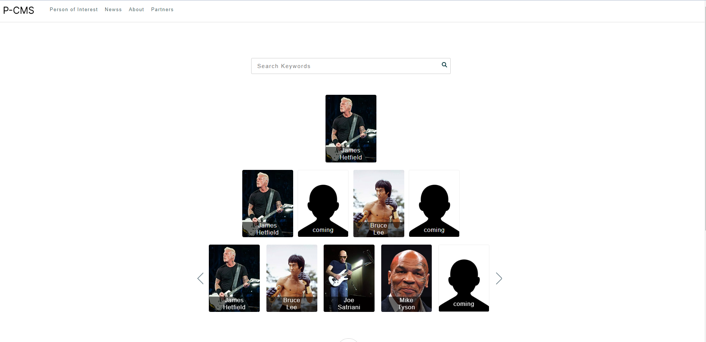
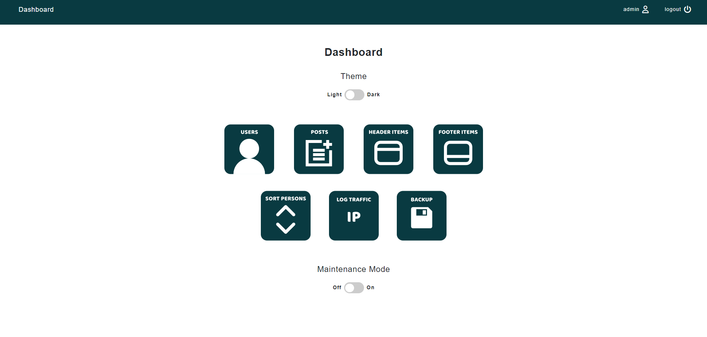

# Persons CMS Website

This is a custom CMS (Content Management System) built using React for the frontend, Node.js with Express for the backend, and MariaDB as the database. The CMS allows users to dynamically manage content, specifically focused on handling "Persons" in the system. It provides an admin dashboard for performing tasks like adding users, managing posts, sorting persons, tracking system information, and creating database backups.

## Front Page



## Features

- **Admin Login**: Admins can log in via the `/admin` route using the default credentials:
  - **Username**: `admin`
  - **Password**: `admin1234`

### Admin Dashboard

After logging in, the admin can access the dashboard at `/admin/dashboard`. From there, the logged-in user can add new users, create new posts, update the header navigation and logo, modify footer items, sort persons on the front page, track visitor IPs, view system information, and create backups for the database and backend.



### Add Users

Manage users, including adding, editing, and deleting users.


### Create and Manage Posts

Manage posts, including adding, editing, and deleting posts from the dashboard.


#### Add Persons Post on Front Page

Add persons to the front page as well as to the "Persons of Interest" page. In the "Persons of Interest" section, you can add multiple titles based on the selected person. If you don't select an existing person, you can add a new person with their first title. All persons on the front page are displayed in a carousel in row 3.


#### Add Media Files

Add media files to display on the persons' details page based on the selected title. You can add multiple media files for one title.


**Note**: Other categories in posts don't have media files; you can only add them as published news.

### Change Header and Footer

#### Header

Change navigation items and the logo.


#### Footer

Modify footer items.


### Sort Items

In this section, you can sort items by order and select persons. It allows you to change the positions of the first and second rows on the front page. Additionally, you can drag and rearrange the positions of the individuals.


### Log Traffic

Track visitor IPs and view system information.


### Create Backups of the Database

Create backups of both the database and backend system from the dashboard.


## Tech Stack

- **Frontend**: React
- **Backend**: Node.js with Express
- **Database**: MariaDB (SQL)

## Prerequisites

Make sure you have the following installed:

- Node.js
- MariaDB

## Add `.env` File to the Backend Folder

Create a `.env` file in the backend folder and add the following configuration:

```bash
NODE_DB_HOST=keni.ba
NODE_DOMAIN=keni.ba
NODE_DB_USER=keniba_bpikd
NODE_DB_PORT=3306
NODE_DB_PASS=personscms123personscms123
NODE_DB_NAME=keniba_bpikd
JWT_SECRET=bpikd123bpikd123
PORT=8000
PROTOCOL=http
BASE_ROUTE=api
```

### Backend Setup

- **Navigate to the backend folder:**

- cd backend

- **Install dependencies:**

- npm install

- **Start the backend server:**

- npm run start

### Frontend setup

- **Navigate to the frontend folder:**

- cd frontend

- **Install dependencies:**

- npm install

- **Start the backend server:**

- npm run start
